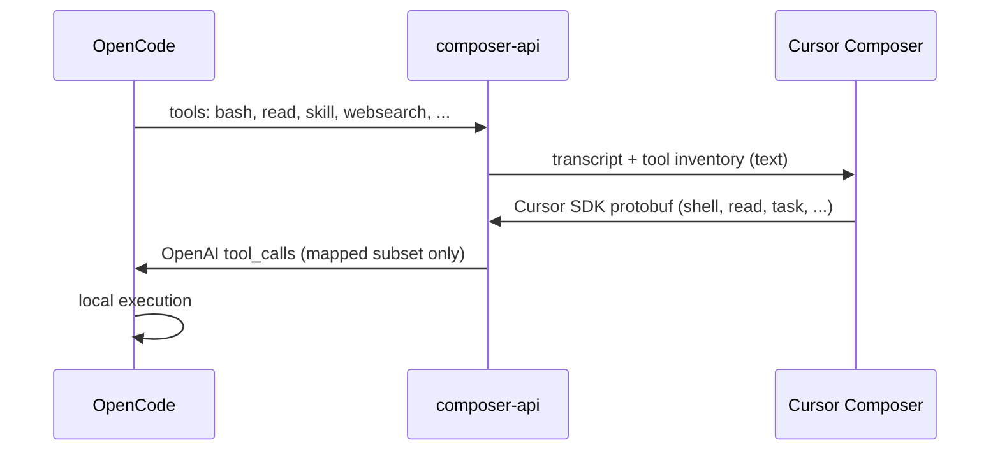

# Composer API

Local OpenCode-compatible API proxy for Cursor Composer.

## Quick start

```bash
pnpm install
cp .env.example .env
pnpm start
```

The server listens on `http://127.0.0.1:8787`. OpenCode base URL:

```txt
http://127.0.0.1:8787/opencodev2/v1
```

Add a custom provider to `~/.config/opencode/opencode.json`:

```json
{
  "$schema": "https://opencode.ai/config.json",
  "providers": {
    "cursor": {
      "npm": "@ai-sdk/openai-compatible",
      "name": "Cursor",
      "options": {
        "baseURL": "http://127.0.0.1:8787/opencodev2/v1",
      },
      "models": {
        "composer-2.5-fast": {
          "name": "Composer 2.5 Fast"
        },
        "composer-2.5": {
          "name": "Composer 2.5"
        }
      }
    }
  }
}
```

Then run OpenCode and put your Cursor API key:

```bash
opencode
/connect
```

## What this is

This project exposes OpenCode routes that adapt OpenAI-style requests into Cursor's local-agent SDK protocol. OpenCode owns local filesystem and shell execution; the server translates SDK tool-call events back into OpenAI-compatible `tool_calls`.

One Node process handles everything:

- OpenCode HTTP API (`/opencodev2/v1/*`)
- Cursor SDK HTTP/2 bridge (internal `/sdk` route)

### How tool calling works

OpenCode sends its tool list (`bash`, `read`, `glob`, …) on each request. This server embeds that list in a text transcript for Cursor Composer. **Composer does not call OpenCode tools directly.** It emits Cursor SDK protobuf tool calls; this adapter decodes them and converts matching calls into OpenAI `tool_calls` for OpenCode to execute locally.

That means:

- A tool must appear in OpenCode's request **and** Composer must emit a compatible Cursor SDK tool call **and** this adapter must map that protobuf field.
- OpenCode-only tools are listed in the prompt but usually **cannot** be invoked through Composer, because Cursor has no matching protobuf tool call for them.



## Tool compatibility

Use `/opencodev2/v1` (SDK harness). The legacy `/opencode/v1` route uses a different Cursor chat protocol and is not the recommended path for tool-heavy workflows.

### Generally reliable

These are mapped from Cursor SDK protobuf and match OpenCode's built-in tools. Day-to-day coding workflows (read files, run shell, edit, delegate to subagents) should work.

| OpenCode tool | Cursor SDK mapping | Notes |
|---|---|---|
| `bash` | `shell` | Primary way to run commands |
| `read` | `read` | |
| `write` | `edit` → `write` | New files via streaming edit are normalized to `write` |
| `edit` | `edit` | |
| `glob` | `glob` | |
| `grep` | `grep` | |
| `list` / `ls` | `ls` | |
| `task` | `task` | Subagents; `subagent_type` can be OpenCode agent names (`explore`, `general`, custom) |
| `webfetch` | `fetch` / `web_fetch` | **Cursor-hosted.** Always advertised in the SDK harness inventory; Cursor fetches the URL and injects `CURSOR WEB FETCH RESULT` |
| `websearch` | `web_search` | **Cursor-hosted.** Always advertised in the SDK harness inventory; Cursor runs search and injects `CURSOR WEB SEARCH RESULT` |

### Mapped, but often unreliable

The adapter can decode these when Composer emits the corresponding Cursor tool call, but **Composer may not choose them** (it may use `bash`/`read` instead, or Cursor-native behavior). Do not depend on these for critical workflows.

| OpenCode tool | Cursor SDK mapping | Caveats |
|---|---|---|
| `todowrite` | `update_todos` | Depends on Composer emitting Cursor's todo tool |
| `question` | `ask_question` | Same; user Q&A may not round-trip cleanly |
| MCP tools | `mcp` | Only when provider/tool names align between Cursor's call and OpenCode's MCP config |

### Not supported (OpenCode-only)

These appear in OpenCode's tool list but **cannot** be invoked via Composer through this adapter, because Cursor does not emit equivalent SDK tool calls:

| OpenCode tool | Why |
|---|---|
| `skill` | No Cursor SDK mapping |
| `lsp` | No Cursor SDK mapping |
| `apply_patch` | OpenCode expects `patchText`; Cursor's `apply_agent_diff` is a different internal API |
| Custom tools (`opencode.json`, plugins) | No Cursor protobuf for arbitrary tool names |
| `read_todos` / other OpenCode-only helpers | Not mapped |

OpenCode's optional `websearch` tool (Exa / Parallel) is **not used for execution** when you route the model through this proxy. The harness always lists `websearch` / `webfetch` for Composer anyway, and Cursor executes them when Composer requests those tool names.

### Previously listed as unreliable (now Cursor-hosted)

| OpenCode tool | Behavior through this proxy |
|---|---|
| OpenCode `websearch` | Ignored for execution; use Cursor web search instead (see above) |
| OpenCode `webfetch` | Ignored for execution; use Cursor web fetch instead (see above) |

### Cursor-only tools (may appear, OpenCode may not run them)

If Composer emits these, the adapter may forward them, but OpenCode often has no matching local tool:

- `semSearch`, `readLints`, and other Cursor-native helpers

### Practical guidance

- **Safe default:** filesystem + shell + `task` subagents + **Cursor-hosted web search/fetch**.
- **Do not assume** OpenCode's native `websearch` / `webfetch` tools run when using this proxy; Cursor handles those instead.
- **Do not assume** `todowrite` or `question` work just because they are enabled in OpenCode permissions.
- **Custom OpenCode subagents** via `task` + `subagent_type` are supported when Composer delegates with the `task` tool.
- **Custom OpenCode function tools** are not supported through this bridge.
- If a feature is OpenCode-specific (skills, LSP tool, patch format), use OpenCode with a native model provider for that workflow instead of this Cursor proxy.

## Supported endpoints

Recommended SDK harness:

- `GET /opencodev2/v1/models`
- `POST /opencodev2/v1/chat/completions`

Legacy Cursor chat-endpoint route:

- `GET /opencode/v1/models`
- `POST /opencode/v1/chat/completions`

Authenticate every request with your Cursor API key as a Bearer token. The key is forwarded to Cursor per request and is not stored.

## Environment variables

Create `.env` from `.env.example`:

| Variable | Required | Purpose |
|---|---|---|
| `CURSOR_BACKEND_BASE_URL` | yes | Cursor backend origin (e.g. `https://api2.cursor.sh`) |
| `CURSOR_LOCAL_AGENT_ENDPOINT` | yes | SDK RPC path (e.g. `/agent.v1.AgentService/Run`) |
| `CURSOR_CHAT_ENDPOINT` | for `/opencode/v1` | Legacy chat RPC path |
| `COMPOSER_API_HOST` | no | Bind address (default `127.0.0.1`) |
| `COMPOSER_API_PORT` | no | Listen port (default `8787`) |
| `COMPOSER_API_REQUEST_TIMEOUT_MS` | no | Close hung HTTP requests from OpenCode (default `130000`, `0` disables) |
| `CURSOR_SDK_STREAM_START_TIMEOUT_MS` | no | Fail if Cursor SDK stream does not start (default `25000`) |
| `CURSOR_SDK_STREAM_IDLE_TIMEOUT_MS` | no | Fail when no SDK frames arrive for this long (default `60000`) |
| `CURSOR_SDK_RUN_TIMEOUT_MS` | no | Hard cap for one SDK run (default `120000`) |
| `CURSOR_SDK_BRIDGE_REQUEST_TIMEOUT_MS` | no | HTTP/2 bridge timeout (default `120000`) |

Client-side: OpenCode uses `CURSOR_API_KEY` as Bearer token (not stored in `.env`).

When a run stalls (for example web search never returns), the server now fails with `504` and codes such as `cursor_sdk_stream_idle_timeout` or `cursor_sdk_run_timeout` instead of hanging indefinitely. Increase the timeout env vars if legitimate runs need more time.

For local OpenCode CLI runs, use the timeout wrapper:

```bash
pnpm opencode:run -- run "your prompt" --model cursor-api/composer-2.5-fast
OPENCODE_RUN_TIMEOUT_MS=180000 pnpm test:opencode
```

## Running with Docker Compose

A `Dockerfile` and `docker-compose.yml` are provided to run the server detached
in the background. The container binds to `0.0.0.0:8787` inside the container
and maps to `${COMPOSER_API_HOST_PORT:-8787}` on the host.

```bash
cp .env.example .env   # fill in CURSOR_BACKEND_BASE_URL, CURSOR_LOCAL_AGENT_ENDPOINT
docker compose up -d --build
docker compose logs -f composer-api   # tail logs
docker compose ps                     # show status / health
docker compose down                   # stop and remove
```

The compose file overrides `COMPOSER_API_HOST=0.0.0.0` so the container is
reachable through the published port. To use a different host port:

```bash
COMPOSER_API_HOST_PORT=18787 docker compose up -d
```

The container exposes `/health` for the built-in healthcheck. Point OpenCode at
`http://127.0.0.1:8787/opencodev2/v1` (or your mapped port).

## Development

```bash
pnpm test
pnpm run typecheck
```
